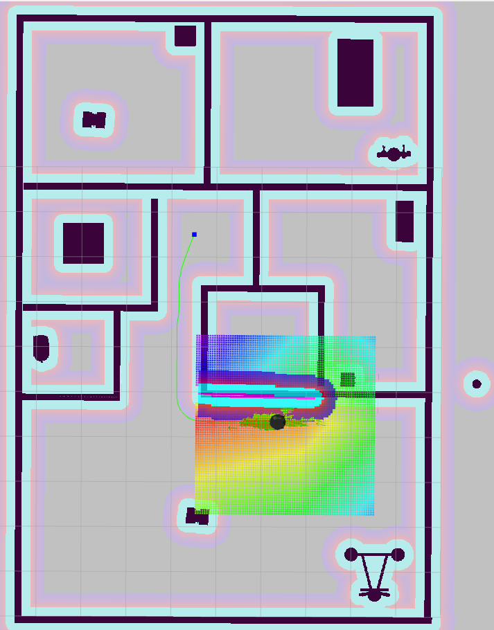
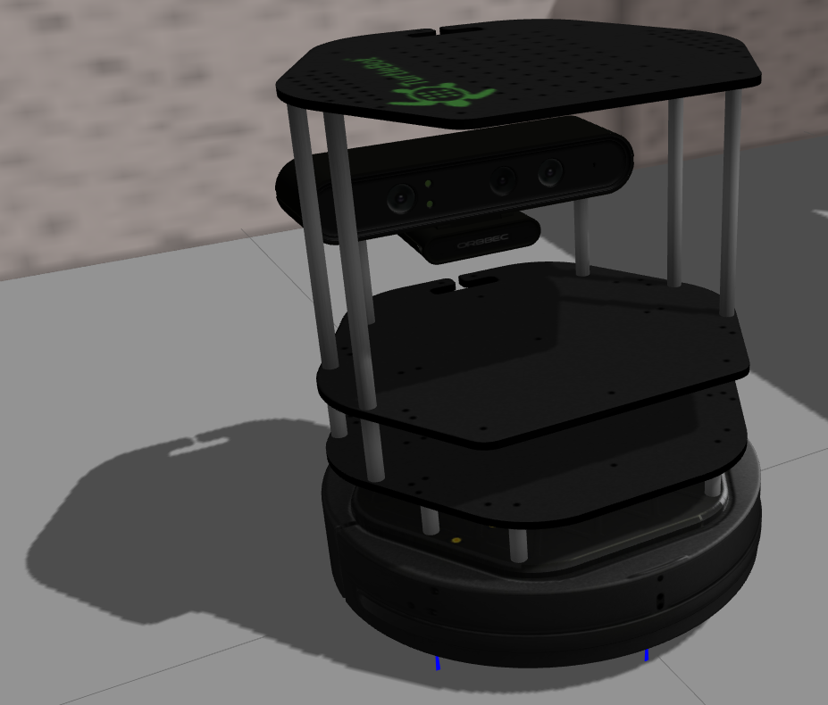
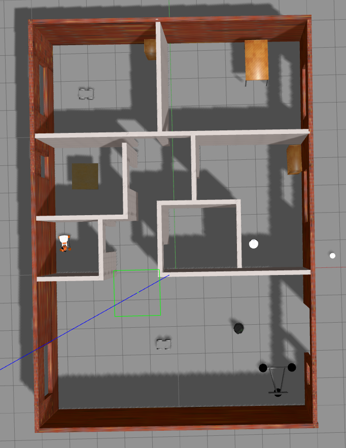
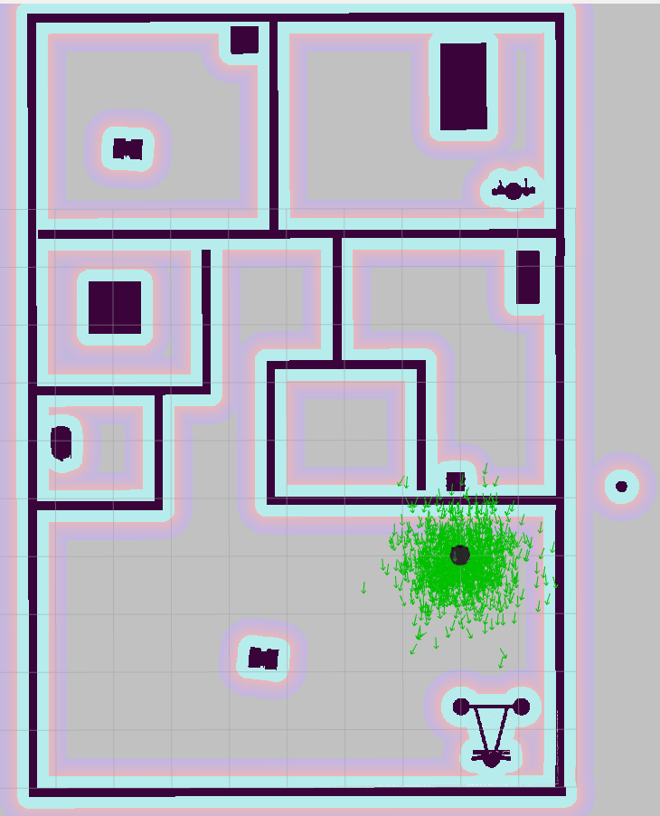
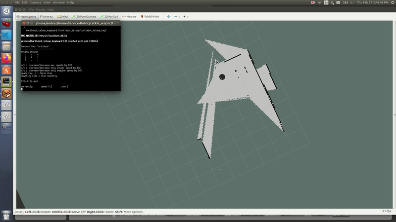
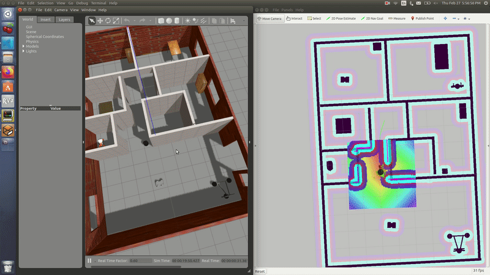

# Home-Service-Robot
## Using Gazebo, Rviz, and ROS



## Setting up the enviroment:
For this project the following set up was used:
- Ubuntu 16.04 LTS OS
- Ros kinetic
- Gazebo 7.0.0
- Rviz 1.12.17

## Installation steps:
- Clone this repository to your home directory:
```
$ git clone https://github.com/AndresGarciaEscalante/Home-Service-Robot.git
```
- Install xterm: 

```
$ sudo apt-get install xterm
```
- Review the dependecies of the Packages using the ```rosdep``` command.

## Launch the Schell Scripts
- To launch the ```test_slam.sh``` file run the following commands:
```
$ source devel/setup.bash
$ ./src/shell_scripts/test_slam.sh 
```
- To launch the ```test_navigation.sh``` file run the following commands:
```
$ source devel/setup.bash
$ ./src/shell_scripts/test_navigation.sh
```
- To launch the ```pick_objects.sh``` file run the following commands:
```
$ source devel/setup.bash
$ ./src/shell_scripts/pick_objects.sh 
```
- To launch the ```home_service.sh``` file run the following commands:
```
$ source devel/setup.bash
$ ./src/shell_scripts/home_service.sh
```

## Project Description
### turtlebot Package
It provides information of the **turtlebot** model such as the **URDF, Gazebo, and other related files** and functions like the **teleoperation**. 



For more detailed information please refere to the following link:
[turtlebot](http://wiki.ros.org/turtlebot_teleop)

### turtlebot_simulator Package 
The main purpose of this package is to put together the **simulated world** and the **robot model** in the **gazebo environment**. It has **many launch files** such as the ```amcl.launch```, ```gmapping.launch```, and ```turtlebot.world.launch```.



For more detailed information please refere to the following link:
[turtlebot_simulator](http://wiki.ros.org/turtlebot_gazebo)

### turtlebot_interactions Package 
It displays the information from **topics** used in the ```turtlebot_simulator Package``` using **Rviz**. It also stores **Rviz configuration files**.



For more detailed information please refere to the following link:
[turtlebot_interactions](http://wiki.ros.org/turtlebot_rviz_launchers)

### slam_gmapping Package
The gmapping package provides laser-based SLAM (Simultaneous Localization and Mapping), as a ROS node called slam_gmapping. Using slam_gmapping, you can create a **2-D occupancy grid map (like a building floorplan)** from **laser** and **pose data** collected by a mobile robot.

For more detailed information please refere to the following link:
[slam_gmapping](http://wiki.ros.org/gmapping)

### pick_objects Package
This package provides the **Pick up** and **Drop Off** positions to the **turtlebot** and also applies **Path Planning** to reach those points using the **Navigation Stack**.

For more detailed information please refere to the following link:
[pick_objects](http://wiki.ros.org/navigation/Tutorials/SendingSimpleGoals)

### add_markers Package
It creates **virtual objects** on the desired positions in the simulated environment. It also provides the communication with the  ```pick_objects Package``` to simulate the **Pick up** and **Drop Off** the virtual object.

For more detailed information please refere to the following link:
[add_markers](http://wiki.ros.org/rviz/Tutorials/Markers%3A%20Basic%20Shapes)


## Project Outcome
The project implements the **translation of a virtual cube** from a **Pick Up location** to a **Drop Off location** in **Autonomous mode**. All the **Schell Scripts** provide a continous progress of the task as shown bellow: 

### test_slam.sh
Implements a **SLAM** to the simulated Gazebo environment.



### test_navigation.sh
Applies **path planning** using the Rviz tool **2D Navigation**.


### pick_objects.sh
Applies **path planning** by executing the ```pick_objetcs.cpp``` from the **Pick Up location** to the **Drop Off location**.



### home_service.sh
Applies **path planning** from the **Pick Up location** to the **Drop Off location** and also **picks up** and **drops** the virtual box respectively. 


**Important:** Check full video in the following link:
[home_service Project](https://www.youtube.com/watch?v=CUUeepdJkQc)

## Future Improvements
- Replace the ***Turtlebot robot*** model by ***my_robot*** model. 